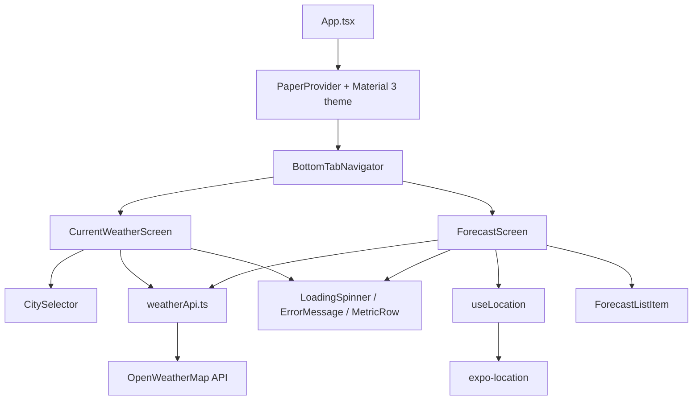
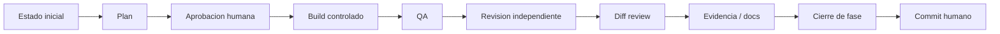
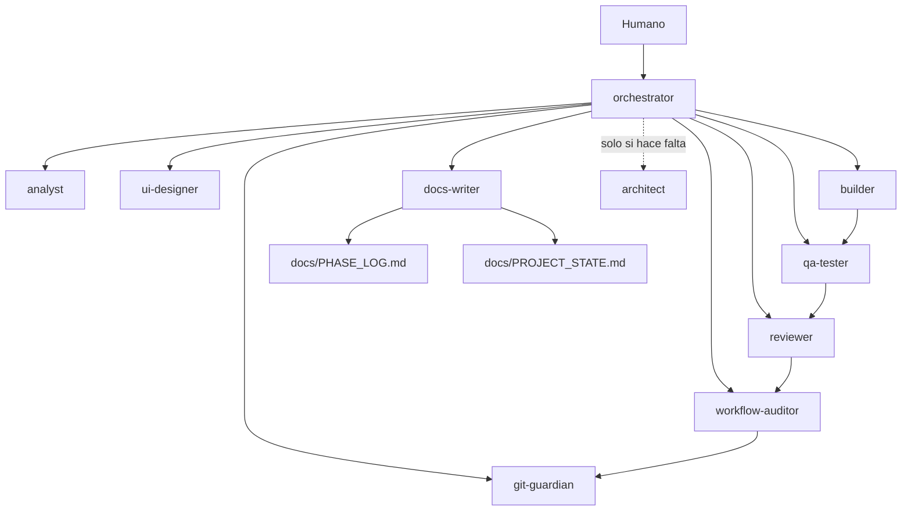
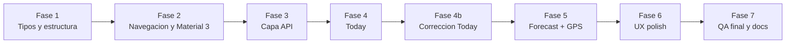

# React Native Orchestrator Practice

Repositorio de practica para experimentar con un workflow multiagente en OpenCode mientras se migra una app Android/Java de clima a Expo/React Native.

El objetivo no fue solo construir una app, sino probar una forma de trabajo por fases: planificacion, aprobacion humana, implementacion acotada, QA, auditoria del diff, documentacion y commit manual.

## Que contiene

- `react_native_app/weather-rn/`: app Expo/React Native migrada.
- `java_base_app/Weather-Hub/`: app Android/Java original usada solo como referencia de lectura.
- `.opencode/agents/`: agentes de OpenCode usados para coordinar, implementar, revisar y auditar.
- `.opencode/commands/`: comandos reutilizables para fases del workflow.
- `docs/workflow/`: contrato de fases y reglas de ruteo de agentes.
- `docs/PHASE_LOG.md`: registro breve de fases completadas.
- `docs/PROJECT_STATE.md`: estado vivo del proyecto.

## App migrada

La app implementa las dos pantallas activas de Weather Hub:

| Pantalla | Descripcion | Fuente original |
| --- | --- | --- |
| Today | Clima actual por ciudad seleccionada | `FragmentTwo` |
| Forecast | Pronostico 5 dias / 3h por GPS | `FragmentThree` |

Fuera de alcance:

- Historical Weather Data, porque el fragment existia pero no estaba activo.
- Busqueda libre de ciudades.
- Cache offline.
- Tests automatizados.
- Dark mode dinamico.

## Arquitectura de la app



## Stack principal

- Expo 56
- React 19
- React Native 0.85
- React Navigation 7
- React Native Paper
- Expo Location
- OpenWeatherMap API

La API key se lee desde `EXPO_PUBLIC_OPENWEATHER_API_KEY`. En una app Expo esta variable queda incluida en el bundle, por lo que se considera aceptable solo para prototipo/demo.

## Como correr la app

```bash
cd react_native_app/weather-rn
npm install
npm run start
```

Para probar datos reales, configurar localmente:

```bash
EXPO_PUBLIC_OPENWEATHER_API_KEY=tu_api_key
```

No se debe commitear `.env`.

## Workflow multiagente

El repositorio practica un flujo por fases con gates estrictos:



Principios:

- Una fase = un objetivo concreto.
- No se implementa sin aprobacion humana explicita.
- No se agregan dependencias sin aprobacion.
- No se toca `.env`.
- No se edita `java_base_app/Weather-Hub/`.
- No se hace commit ni push automaticamente.
- El agente que implementa no aprueba su propio trabajo.

## Agentes de OpenCode



| Agente | Responsabilidad |
| --- | --- |
| `orchestrator` | Coordina fases, gates y delegacion. |
| `analyst` | Lee codigo y contexto, sin editar. |
| `ui-designer` | Propone UX/UI, sin implementar. |
| `builder` | Implementa solo alcance aprobado. |
| `qa-tester` | Ejecuta checks y valida funcionamiento. |
| `reviewer` | Revisa calidad tecnica, bugs y riesgos. |
| `workflow-auditor` | Compara el cierre reportado contra el repo real. |
| `git-guardian` | Revisa diff antes del commit humano. |
| `docs-writer` | Actualiza documentacion persistente cuando corresponde. |
| `architect` | Solo para decisiones arquitectonicas grandes. |

## Comandos OpenCode

| Comando | Uso |
| --- | --- |
| `/plan-fase` | Crear plan sin implementar. |
| `/build-fase` | Ejecutar una fase aprobada. |
| `/qa-fase` | Verificar una fase sin editar. |
| `/review-fase` | Auditar cierre contra Git real. |
| `/next-prompt` | Generar prompt seguro para la siguiente fase. |
| `/git-check` | Revisar estado antes de commit humano. |

Ejemplo de uso:

```text
/plan-fase Fase 6 - UX polish y estados edge
```

Luego, con aprobacion explicita:

```text
/build-fase Aprobado para Fase 6 ...
```

## Fases realizadas



Ver detalle en `docs/PHASE_LOG.md`.

## Estado actual

La migracion funcional esta completa:

- Today carga clima por ciudad.
- Forecast usa GPS y muestra pronostico.
- Hay manejo de loading, error, retry y mensajes de red.
- La documentacion del workflow V2 esta versionada.

Pendientes conocidos:

- QA end-to-end real en dispositivo/emulador.
- Validacion con API key real de OpenWeatherMap.
- Configuracion iOS si se prueba ubicacion en iOS.
- Posible soporte futuro para deteccion offline proactiva con NetInfo.

## Licencia

Este repositorio es de practica. Revisar licencias de la app base y dependencias antes de reutilizarlo en otro contexto.
